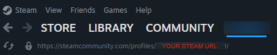

# Steam MCP Server

**Steam MCP Server** is a simple Python-based server for interacting with Steam Community features, such as fetching game achievements, searching for top-rated guides, and retrieving detailed guide content.

## Features

- Fetch and display game achievements, including unlock status and global unlock rates.
- Search for top-rated Steam Community guides for a specific game and keyword.
- Retrieve the full content of a Steam Community guide by its ID.

## Prerequisites

To use the Steam MCP Server, you need the following:

1. **Steam API Key**:  
   Obtain your Steam API key from the [Steam API Key Registration page](https://steamcommunity.com/dev/apikey).  
   This key is required to interact with Steam's web API.

   2. **Steam User ID**:  
   Retrieve your Steam User ID, which is necessary for certain API operations. 
   You can find it in your Steam profile URL in steam client if you open your profile.
   


## Installation

To use this project, clone the repository and navigate to the project folder:
```bash
git clone https://github.com/Fllugel/steam-mcp-server
```

## Usage

You can run the server to connect it to any mcp supported client via STDIO, using the following command:
```bash
uv --directory PATH/TO/YOUR/steam-mcp-server run steam-mcp-server
```

## Adding to Claude

To add this MCP to Claude, use the following configuration:

```json
"steam-mcp": {
  "command": "uv",
  "args": [
    "--directory",
    "PATH/TO/YOUR/steam-mcp-server",
    "run",
    "steam-mcp-server"
  ],
  "env": {
    "API_KEY": "YUR_API_KEY",
    "STEAM_ID": "YOUR_STEAM_ID"
  }
}
```

